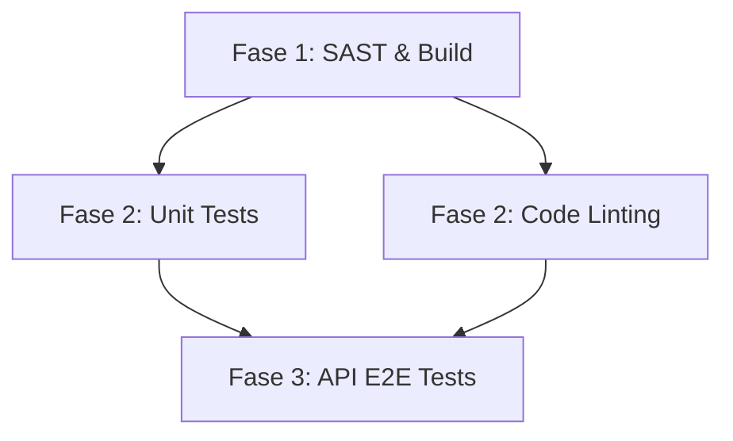

# 🛒 E-Commerce API - Automação & Testes com CI/CD APONTI - FAP.2026

> Projeto prático voltado para o planejamento de cenários reais de testes de API e implementação de uma pipeline de integração contínua (CI/CD) aplicando o conceito de **Fail Fast**.

---

## 🛠️ Tecnologias Utilizadas

*   **Runtime:** [Node.js](https://nodejs.org) (v24)
*   **Pipeline CI/CD:** [GitHub Actions](https://github.com/features/actions)
*   **Clientes de Testes:** [Postman](https://postman.com) / [cURL](https://curl.se)
*   **Interpretador de Scripts:** Bash (Linux)

---

## ⚙️ Arquitetura da Pipeline (Estratégia *Fail Fast*)

Para otimizar o tempo de execução e economizar recursos do GitHub, a esteira foi desenhada sob o padrão ideal de mercado (**Fail Fast**). Um erro em estágios simples bloqueia imediatamente os testes pesados.

O fluxo de dependências segue rigorosamente a árvore abaixo:

1.  **Fase 1 (sast / build):** Varre falhas de segurança estáticas e monta o projeto.
2.  **Fase 2 (test / lint-quality):** Roda os testes unitários e valida a formatação de escrita do código (Lint). *Só executa se a Fase 1 passar.*
3.  **Fase 3 (api-tests):** Dispara o script automatizado `bash scripts/api-tests.sh` simulando requisições com a API ativa. *Só executa se TODOS os testes da Fase 2 passarem.*

---

## 📋 Cenários de Teste Documentados

Seguindo as especificações propostas, o projeto possui 6 cenários detalhados no plano de testes oficial:

### 🔥 Smoke Tests (Testes de Fumaça)
*   **CT-001:** Validar a capacidade básica de permitir a entrada de um usuário (Login).
*   **CT-004:** Validar a comunicação básica com a API financeira para métodos de pagamento à vista.

### 🩺 Sanity Tests (Testes de Sanidade)
*   **CT-002:** Validar se a regra de negócio impede o cadastro de e-mails repetidos.
*   **CT-005:** Validar as máscaras e restrições dos campos de cartão de crédito para evitar envio de lixo eletrônico para a API de pagamento.
.

### 🔄 Regression Tests (Testes de Regressão)
*   **CT-003:** Validar os mecanismos de segurança da API contra tentativas sucessivas de invasão
*   **CT-006:** Validar o fluxo completo de conversão de uma venda utilizando cartão de crédito

> *Nota: Os documentos completos e as evidências (prints de requisição/retorno) foram entregues na plataforma do curso DevOps da aponti.*

---

## 🧑‍💻 Autor

*   **José Augusto** - [perfil](https://github.com/DevAugustomelo)
*   **Turma/Curso:** Turma_02 DevOps **FAP.2026**
